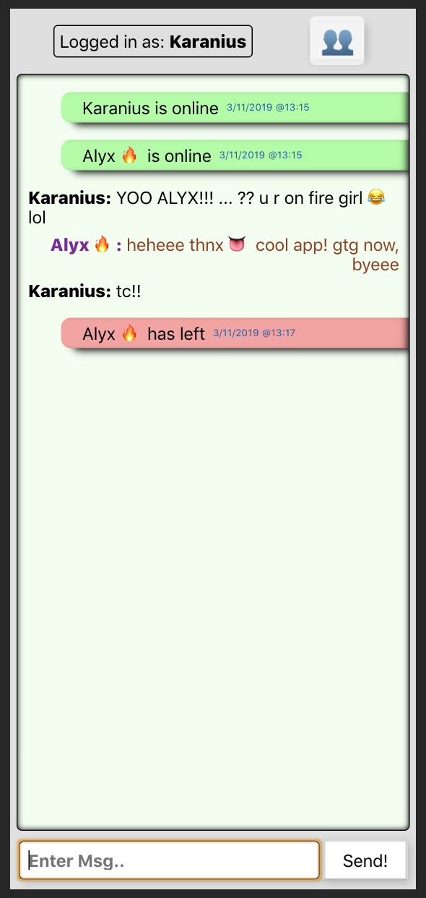

Stable version - LIVE CHAT :  https://appschat.herokuapp.com/ 

Tech : React , Node.js

Dont be shy if you feel like you want to add a new component to the app!!
some cool simple ideas for improvement would be: 
{ 1: function stringToEmoji() { 
        replaces words or phrases such as 'smile' 
        with '😊' emoji  when sending a msg
  },
  2: function hyperLinkMaker(){
        if a link is submited, the app will display it as a clickable link.
  }

# APPSchat
A basic, react based, real time chat application. [ Pre-Production ]
This repo might be a little buggy. However the live version is much more improved and fully stable.
You can find the backend repo @ https://github.com/karanius/APPSchat-backend

